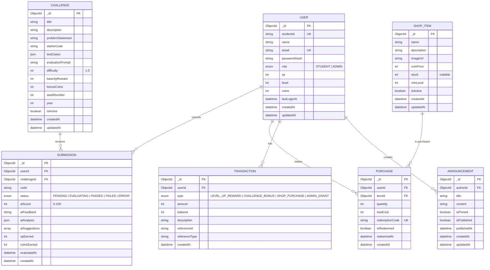
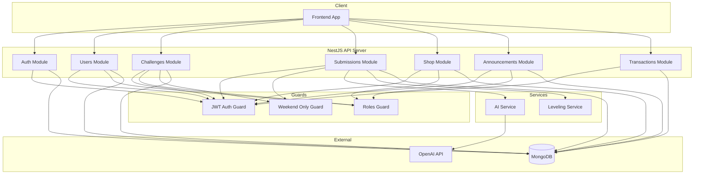
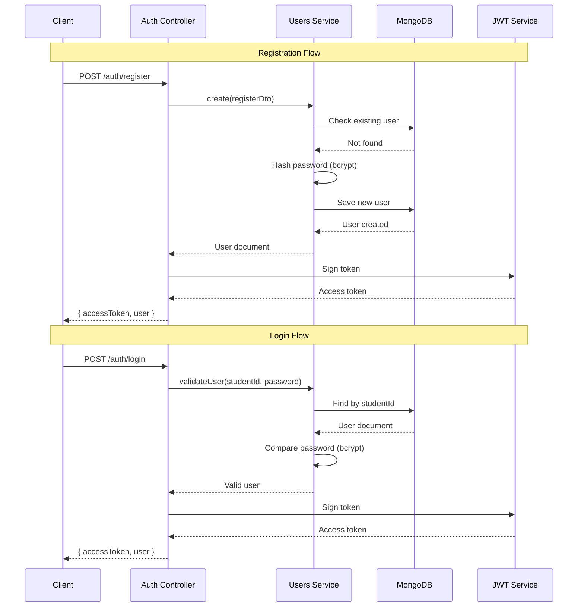
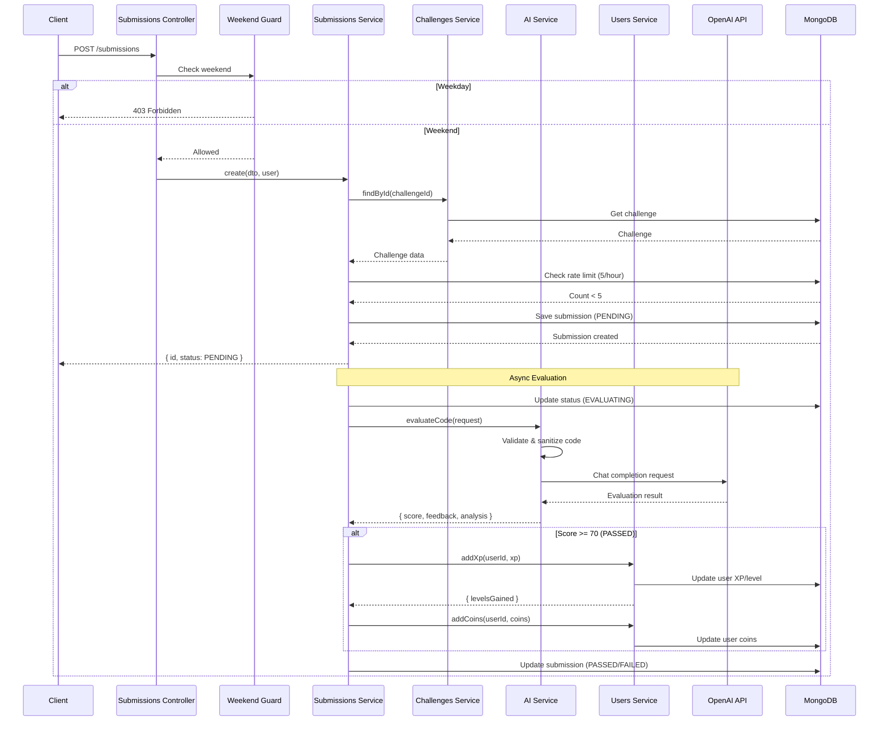
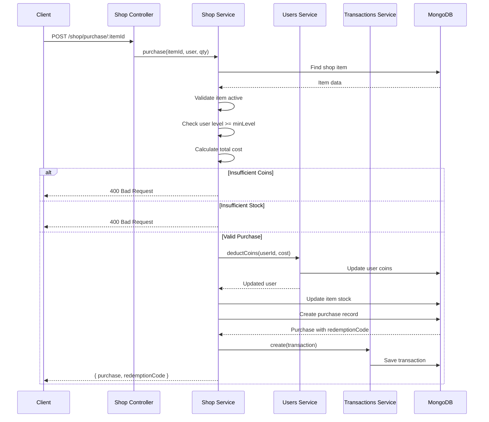
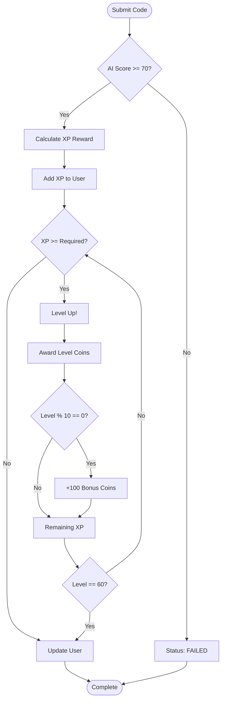
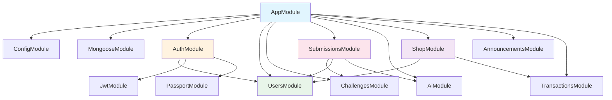
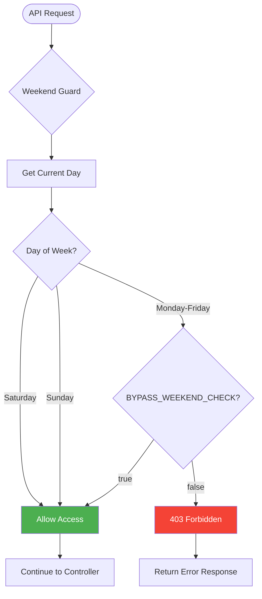
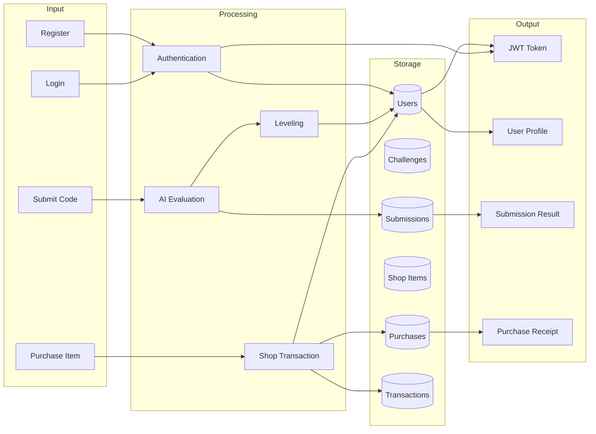

# System Diagrams

## Entity Relationship Diagram (ERD)

---

## System Architecture Flow

---

## User Registration & Authentication Flow

---

## Challenge Submission & AI Evaluation Flow

---

## Shop Purchase Flow

---

## Leveling System Flow

---

## Tier Progression Visualization

```mermaid
flowchart LR
    subgraph NEWBIE["Newbie (0-10)"]
        L1[Level 1]
        L10[Level 10]
    end

    subgraph BEGINNER["Beginner (11-20)"]
        L11[Level 11]
        L20[Level 20]
    end

    subgraph INTERMEDIATE["Intermediate (21-30)"]
        L21[Level 21]
        L30[Level 30]
    end

    subgraph ADVANCED["Advanced (31-40)"]
        L31[Level 31]
        L40[Level 40]
    end

    subgraph EXPERT["Expert (41-50)"]
        L41[Level 41]
        L50[Level 50]
    end

    subgraph MASTER["Master (51-60)"]
        L51[Level 51]
        L60[Level 60]
    end

    L1 --> L10
    L10 --> L11
    L11 --> L20
    L20 --> L21
    L21 --> L30
    L30 --> L31
    L31 --> L40
    L40 --> L41
    L41 --> L50
    L50 --> L51
    L51 --> L60

    style NEWBIE fill:#808080
    style BEGINNER fill:#32CD32
    style INTERMEDIATE fill:#1E90FF
    style ADVANCED fill:#9932CC
    style EXPERT fill:#FFD700
    style MASTER fill:#FF4500
```

---

## Module Dependency Graph

---

## Weekend Access Control

---

## Data Flow Overview

---

## How to View These Diagrams

These diagrams are written in [Mermaid](https://mermaid.js.org/) syntax. You can view them:

1. **GitHub** - Renders Mermaid diagrams automatically in markdown files
2. **VS Code** - Install "Markdown Preview Mermaid Support" extension
3. **Online** - Paste code at [mermaid.live](https://mermaid.live/)
4. **Documentation tools** - Docusaurus, GitBook, Notion all support Mermaid
